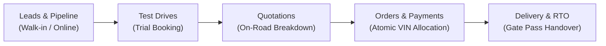

# Trisha Motors — Architecture & Codebase Structure Documentation

## 1. Overview & System Design

**Trisha Motors** is an enterprise-grade, 2-in-1 Electric Vehicle Dealership Web Platform combining:
1. **Public-Facing Marketing Showroom**: High-converting EV discovery, specification comparison, on-road price calculator with state subsidies, and online test-drive booking.
2. **5-Pillar Showroom Operations CRM**: Streamlined staff management system covering showroom overview, inventory tracking, customer relationships, the end-to-end sales lifecycle, and executive statistics.
3. **Standalone Rust Axum Superuser Panel (`/admin`)**: Ultra-secure administrative interface served directly by the Rust Axum backend binary on Render.

---

## 2. 5-Pillar CRM Modular Architecture

All CRM capabilities are strictly organized under `web/src/modules/`, adhering to a predictable modular folder convention where each tab has:
- `[tab]_main.tsx`: The primary coordinator and route entrypoint.
- `components/`: Granular, reusable sub-page components and modals isolated to that domain.

```
web/src/modules/
├── overview/
│   ├── overview_main.tsx                # Showroom Command Center entrypoint
│   └── components/
│       ├── OverviewMetrics.tsx          # Real-time stock, sales volume, and cash cards
│       └── RecentActivity.tsx           # Recent bookings and stock ageing monitor
│
├── inventory/
│   ├── inventory_main.tsx               # Vehicle inventory coordinator & filter table
│   └── components/
│       ├── AddStockModal.tsx            # Form to register new physical units with VIN
│       └── VehicleDetailSubPage.tsx     # Physical VIN inspection, specs, and status
│
├── customer/
│   ├── customer_main.tsx                # Customer directory and search coordinator
│   └── components/
│       └── CustomerDetailDrawer.tsx     # Contact details, GSTIN, and history modal
│
├── sales/
│   ├── sales_main.tsx                   # Central coordinator with sub-tab switcher
│   └── components/
│       ├── LeadsSubPage.tsx             # 7-stage visual Kanban pipeline
│       ├── TestDrivesSubPage.tsx        # Customer trial booking and feedback log
│       ├── QuotationsSubPage.tsx        # Server-side on-road quote calculator
│       ├── OrdersSubPage.tsx            # Physical vehicle allocation & ledger list
│       └── OrderDetailSubPage.tsx       # Booking contract, part-payments, RTO & delivery
│
└── statistics/
    ├── statistics_main.tsx              # Executive intelligence & reports entrypoint
    └── components/
        ├── SalesSummaryChart.tsx        # Lead conversion funnel drop-off analytics
        └── StockAgeingReport.tsx        # Inventory holding duration (<30d, 30-60d, >90d)
```

---

## 3. Navigation & Routing Architecture

### 3.1 Sidebar Navigation
The left sidebar (`web/src/components/layout/Sidebar.tsx`) provides 5 core pillars:

| Tab Name | Route | Purpose | Key Icons |
|---|---|---|---|
| **Overview** | `/crm/overview` | Command center, high-level KPIs, recent orders | `LayoutDashboard` |
| **Inventory** | `/crm/inventory` | Physical EV units, VIN allocation, stock filter | `Car` |
| **Customer** | `/crm/customer` | Individual & business buyer directory | `Users` |
| **Sales** | `/crm/sales` | Leads, test drives, quotes, orders & payments | `ShoppingBag` |
| **Statistics** | `/crm/statistics` | Conversion funnel, stock ageing, executive metrics | `BarChart3` |

### 3.2 Fixed Geometry & Layout Standards
- **Non-Scrolling Sidebar**: Configured with `h-full overflow-hidden shrink-0 select-none` within an isolated viewport container (`h-screen overflow-hidden`).
- **Main Content Isolation**: Vertical scrolling is confined strictly to `<main className="overflow-y-auto">`, ensuring the sidebar and navbar never stretch or shift.
- **Dedicated Bottom Logout**: The **Sign Out** button is pinned exclusively at the bottom of the sidebar.

### 3.3 Dynamic Route Breadcrumbs
Implemented in `web/src/components/common/Breadcrumbs.tsx` and mounted in `Navbar.tsx`:
- Replaces static tags with interactive, route-aware links.
- Example paths:
  - `/crm/overview` → `Home > CRM > Overview`
  - `/crm/inventory/123` → `Home > CRM > Inventory > #123...`
  - `/crm/sales?tab=orders` → `Home > CRM > Sales > Orders & Payments`
  - `/crm/sales?tab=orders&order_id=456` → `Home > CRM > Sales > Orders & Payments > #456...`

---

## 4. Sales Lifecycle Sub-Module Architecture

The `sales` module coordinates the 4 stages of dealership commerce:



1. **Leads (`LeadsSubPage.tsx`)**: 7-stage Kanban board (`new` → `contacted` → `test_drive_scheduled` → `quoted` → `negotiating` → `won` / `lost`).
2. **Test Drives (`TestDrivesSubPage.tsx`)**: Slot scheduling, demo vehicle allocation, and customer driving feedback logging.
3. **Quotations (`QuotationsSubPage.tsx`)**: Automated on-road pricing with base ex-showroom, insurance, RTO registration, accessories, dealer discounts, and state EV subsidies.
4. **Orders (`OrdersSubPage.tsx` & `OrderDetailSubPage.tsx`)**: Atomic allocation of physical VIN stock, booking deposit verification, part-payment recording, RTO registration tracking, and delivery sign-off.

---

## 5. Security & Double-Selling Prevention

### Atomic Database-Level VIN Locking
- Physical vehicles in `vehicles` table have a unique constraint on `vin`.
- When an order is created, the vehicle's status transitions to `reserved` or `sold`.
- The PostgreSQL transaction guarantees that two staff members cannot book the same physical VIN simultaneously.

### Strict Role Access Control
- **Superuser**: Full platform and tenant access via the Axum binary panel at `/admin`.
- **Manager**: Full operational access across all 5 CRM modules (`overview`, `inventory`, `customer`, `sales`, `statistics`).
- **Customer**: Self-service portal at `/my-account` to track booked vehicles, download invoices, and view subsidy approvals.
- **No Switching**: Role spoofing and client-side role toggling are completely disabled. Accounts authenticate strictly against their database-persisted role.

---

## 6. Build & Local Execution

### Frontend (Vite + React 18 + Tailwind CSS)
```bash
cd web
npm install
npm run dev -- --host 0.0.0.0 --port 5173
```
- Production Build: `npm run build` (outputs to `dist/`).

### Backend (Rust Axum + SQLx + Supabase PostgreSQL)
```bash
cargo run --release --bin ev-dealership-backend
```
- Serves REST API on port `8080`.
- Serves Superuser Admin UI directly at `http://localhost:8080/admin`.
